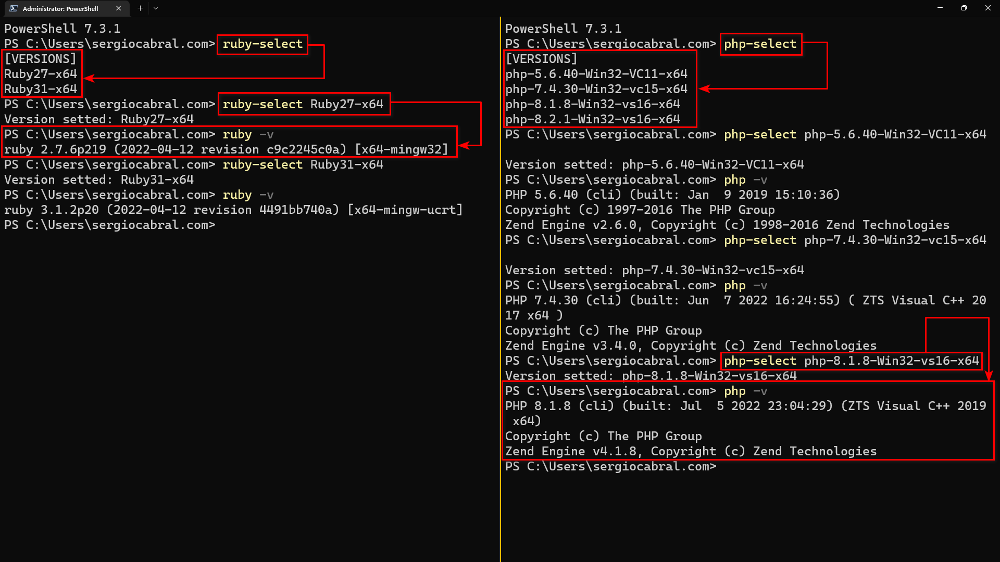
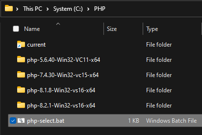
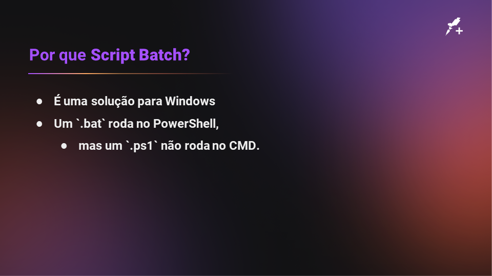

  

# Seletor de versão de aplicativo

_(esse script é uma solução para Windows apenas)_

Muitos aplicativos precisam manter suas versões anteriores por uma questão de legado.

Por exemplo: NodeJS, PHP, Ruby, Java, etc.

Então como usar, por exemplo, a versão 10 e também a versão 14 do NodeJS?
Para resolver problemas assim existe o _nvm_, um gerenciador de versões do NodeJS para você poder ter várias versões no seu ambiente.

Mas o _nvm_, mais do que um seletor de versões, também instala as versões do NodeJS.
Esse script aqui nesse repositório apenas faz a seleção de versões.
A instalação você que terá de fazer manualmente.

Segue abaixo um print de como as versões do Ruby e PHP foram selecionadas uma de cada vez na linha de comando e como isso pode ser comprovado ao pedir que o programa exibisse o número da versão.

## Instalação

Crie uma pasta para receber as várias versões do app.
Por exemplo, `C:\PHP`.

Dentro dela você descompacta as várias versões.
Por exemplo, `php-5.6.40-Win32-VC11-x64`, `php-7.4.30-Win32-vc15-x64`, `php-8.1.8-Win32-vs16-x64` e `php-8.2.1-Win32-vs16-x64`.

Coloque esse script dentro de `C:\PHP` e renomeie ele para algo como `php-select.bat`.

Registre na variável de ambiente `PATH` tanto o caminho `C:\PHP` para poder deixar acessível o `php-select.bat`, mas também o caminho `C:\PHP\ current` que será o link para o diretório da versão selecionada.

Visualmente ficará como:

## Slides da aula

Esse repositório foi feito com base em uma aula que pude ministrar na Rocketseat+.
Abaixo seguem os slides dessa aula.

## Rocketseat+

|  |
| :-: |
|[sergiocabral.com](https://sergiocabral.com)|